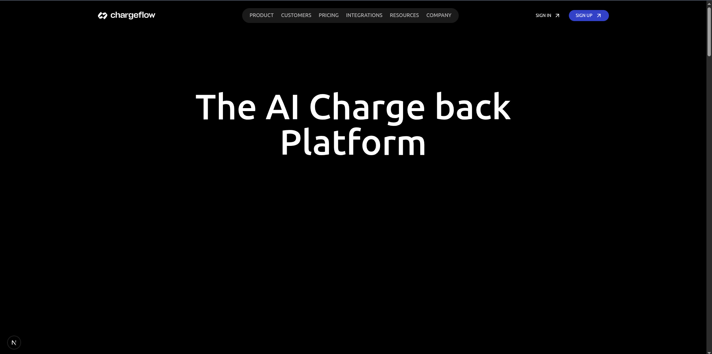
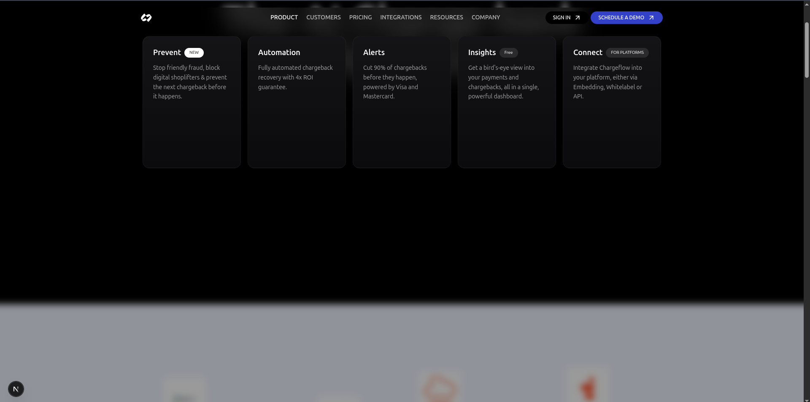
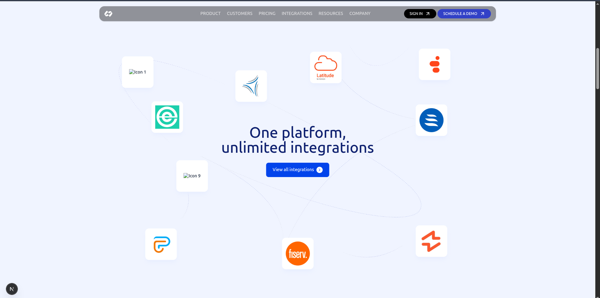
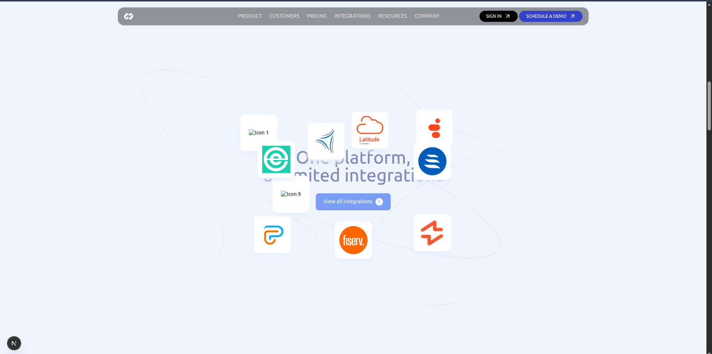

# 🚀 Omnistra Frontend Technical Assessment

This repository contains my submission for the **Frontend Engineer
Technical Assessment** for **Omnistra (Private) Limited**.

The objective of this implementation was to demonstrate:

-   Pixel-level UI accuracy
-   Interaction fidelity
-   Clean component architecture
-   Responsive design across devices
-   Maintainable and scalable code structure

------------------------------------------------------------------------

## 🛠️ Tech Stack & Frame Works

-   Next.js
-   TypeScript
-   Tailwind CSS
-   Framer Motion

------------------------------------------------------------------------

## 📂 Project Setup

### 1️⃣ Clone the Repository

``` bash
git clone https://github.com/Md-Mubin/Omnistra-Assesment.git
cd Omnistra-Assesment
```

### 2️⃣ Install Dependencies

``` bash
npm install
```

------------------------------------------------------------------------

## 🧑‍💻 Run Locally (Development)

``` bash
npm run dev
```

Visit:

    http://localhost:3000

------------------------------------------------------------------------

## 🏗️ Production Build

``` bash
npm run build
npm start
```

------------------------------------------------------------------------

## 🎯 Key Implementation Highlights

-   Pixel-accurate layout implementation
-   Reusable component structure
-   Clean folder organization
-   Responsive UI
-   Interactive states (hover, transitions)
-   Maintainable and readable code

------------------------------------------------------------------------

## 📸 Screenshots

Example:

``` 






```
------------------------------------------------------------------------

## 📬 Submission Details

Submitted as part of the hiring process for Omnistra (Private) Limited.\
Submission deadline: 2 March 2026

------------------------------------------------------------------------

## 📌 Notes

The project is structured for clarity, scalability, and
maintainability.\
No unnecessary dependencies were introduced, and the architecture allows
easy feature extension.

------------------------------------------------------------------------
